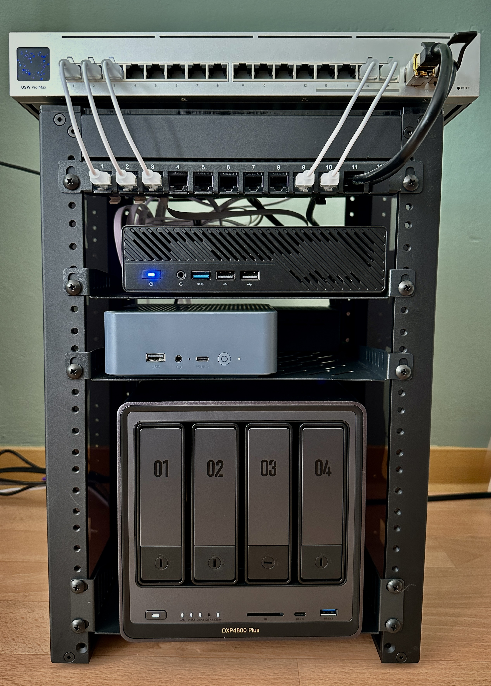
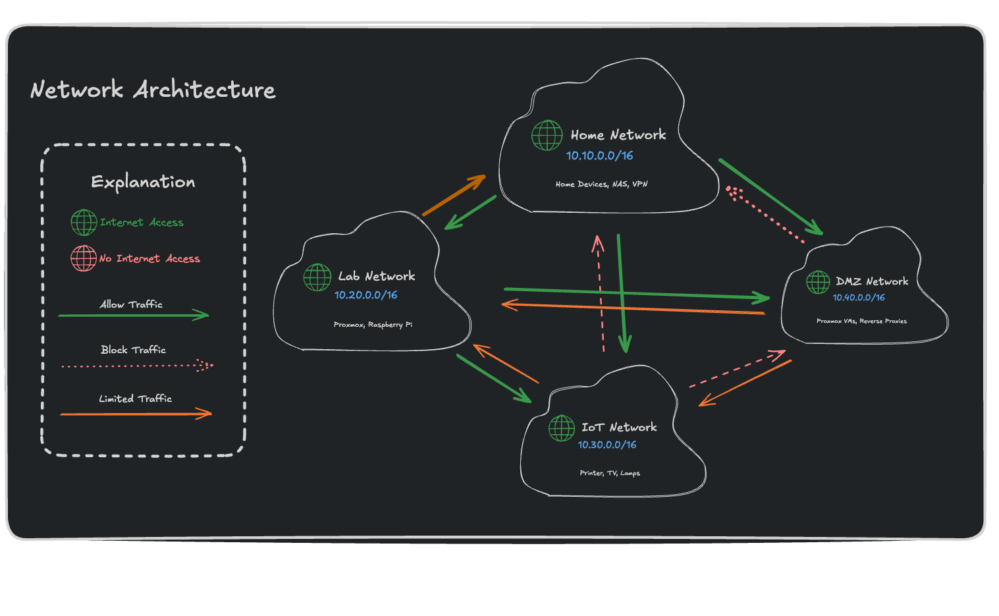
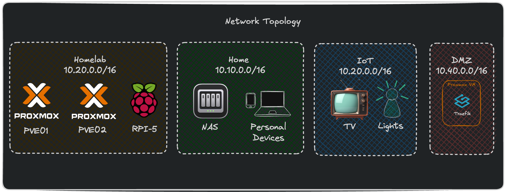
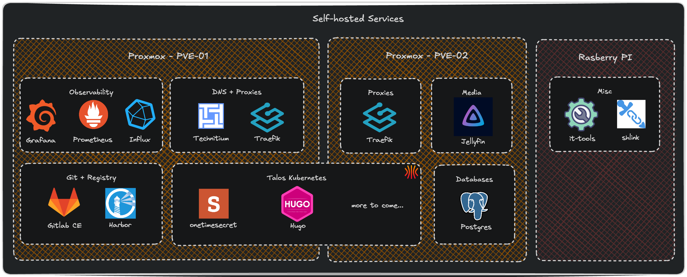

# Cozyplace Homelab

> A deep dive into my self-hosted, on-prem infrastructure — built for learning, tinkering, and owning my own data.

This repo documents everything about my homelab: the hardware it runs on, how the network is designed, what services are deployed, and the lessons learned along the way. Whether you're just getting started or looking for ideas to level up your own setup, I hope you find something useful here.

The stack runs on a mix of x86 mini PCs and a Raspberry Pi, managed through Proxmox and connected via a Ubiquiti network with full VLAN segmentation. A UGREEN NAS handles bulk storage and backups, while services like GitLab, Grafana, Jellyfin, and more run across the cluster.

 

---

## Overview

| Topic | Description |
|-------|-------------|
| [Hardware](docs/hardware.md) | Servers, NAS, networking gear, and all the specs |
| [Networking](docs/networking.md) | VLANs, firewall rules, topology, and network architecture |
| [Services](docs/services.md) | Everything running on the cluster — apps, monitoring, and more |
| [Proxmox](docs/proxmox.md) | Hypervisor setup, VM/CT management, and clustering |
| [Storage](docs/storage.md) | ZFS, NFS shares, backup strategy, and data redundancy |
| [Lessons Learned](docs/lessons-learned.md) | Pain points, gotchas, and things I'd do differently |

---

## Quick Glance

Here's what powers the lab at a high level:

- **Compute** — Minisforum MS-01 (i9-12900H) + Beelinq EQR6 (Ryzen 7 6800U) + Raspberry Pi 5
- **Storage** — UGREEN DXP4800 Plus NAS with 16 TB HDD in RAID 1 + NVMe caching
- **Network** — Ubiquiti DreamRouter 7, USW Pro Max 16, and FRITZ! mesh Wi-Fi
- **Hypervisor** — Proxmox VE
- **Orchestration** — More details in the [services page](docs/services.md)

---

## Architecture at a Glance

| Network | Topology | Services |
|---|---|---|
|  |  |  |

---

## Contributing & Feedback

Found something useful? Have a suggestion? Feel free to open an issue or start a discussion. This is a living document — it grows as the lab grows.
